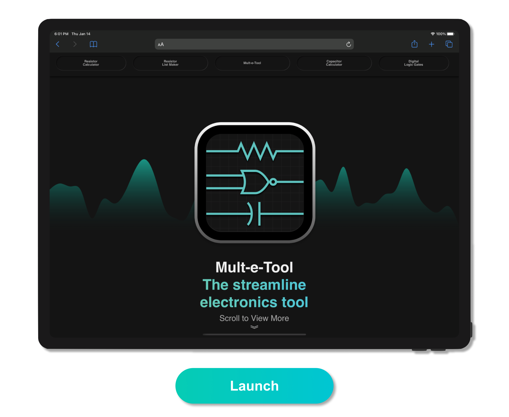

Welcome, to my GitHub page. Hope you find something useful or a least enjoyable here. 

<b>Programming Languages I Use</b> 
C • MATLAB • HTML • CSS • JavaScript • Python • Swift

 

 

<h3>Online Web-Applications:</h3>
<h6>For best performance use a desktop/laptop computer. Development for <b>Dots and Boxes</b> and <b>Polarized Squares</b> still underway.</h6>
 
 

<h3>Mult-e-Tool QR Codes:</h3>
<h6>Scan with smartphone camera</h6>
 
 

<h3>Cybertruck UI - Concept Recreation:</h3>
<h6>An interactive Tesla Cybertruck UI concept/mockup recreation.</h6>

  Disclaimer: Created for educational and experimental purposes.

<h3>External Platforms</h3>

&nbsp;&nbsp;&nbsp;&nbsp;&nbsp;
 

